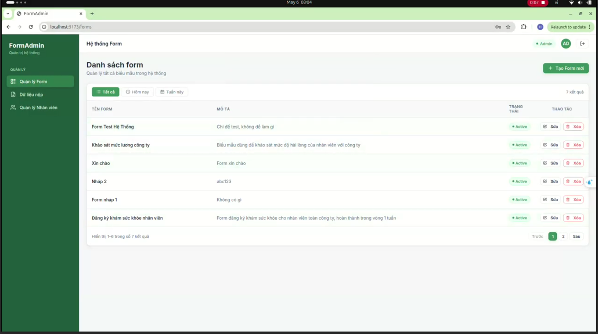
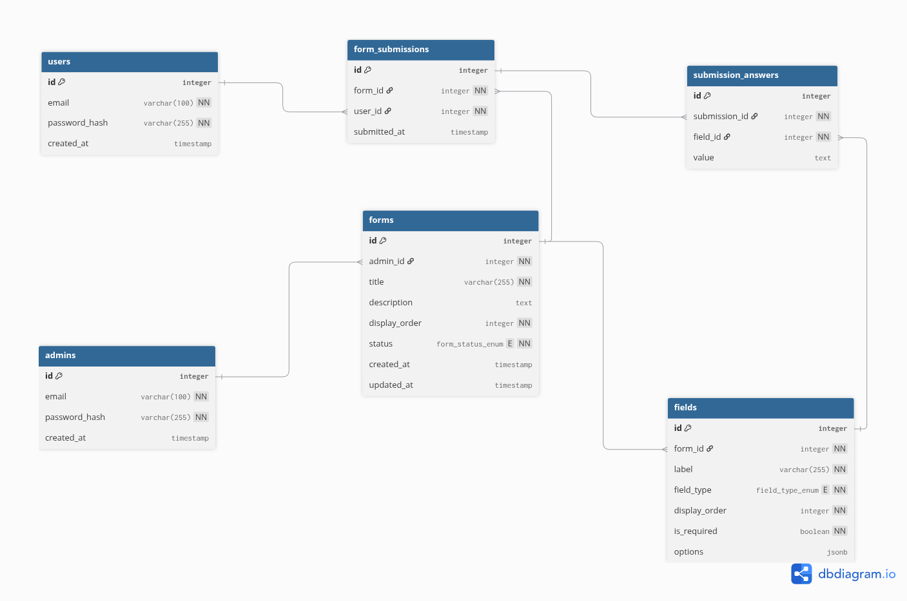

# DỰ ÁN HỆ THỐNG QUẢN LÝ FORM TOPCV

Hệ thống tạo, quản lý biểu mẫu và thu thập kết quả do nhân viên hoàn thiện biểu mẫu. 
Có hỗ trợ upload - dowload và lưu trữ file.

---

## Mục lục

- [Giới thiệu](#giới-thiệu)
- [Video demo](#video-demo)
- [Công nghệ sử dụng](#công-nghệ-sử-dụng)
- [Thiết kế cơ sở dữ liệu](#thiết-kế-cơ-sở-dữ-liệu)
- [Chạy dự án](#chạy-dự-án)
- [Hướng dẫn sử dụng](#hướng-dẫn-sử-dụng)
- [API Documents](#api-documents)

---

## Giới thiệu

Đây là hệ thống cho phép quản trị viên tạo các biểu mẫu (forms) động với nhiều loại trường dữ liệu khác nhau (text, number, select, multi_select, file upload...). Người dùng cuối có thể truy cập, điền form và đính kèm tài liệu. Mọi dữ liệu và file chứng chỉ được lưu trữ an toàn và quản lý tập trung.

**Các tính năng chính:**
* Quản lý Form linh hoạt (Thêm, sửa, trạng thái Active/Draft).
* Hỗ trợ đa dạng loại dữ liệu đầu vào.
* Quản lý upload và truy xuất file tốc độ cao.
* Xác thực và phân quyền người dùng (Admin & User).

---

## Video demo


[](https://drive.google.com/file/d/1R_uwb_AvW7ljrb9n1KXX85nI6x-BwJLO/view?usp=drive_link)

---

## Công nghệ sử dụng

Dự án được xây dựng dựa với các công nghệ như sau:

*   **Backend:** FastAPI (Python), SQLAlchemy
*   **Frontend :** React, Vite
*   **Database:** PostgreSQL 15
*   **Object Storage:** MinIO (S3 Compatible)
*   **Deployment & Infrastructure:** Docker, Docker Compose

---

## Thiết kế cơ sở dữ liệu

Sơ đồ quan hệ thực thể (ERD) mô tả cấu trúc lưu trữ của hệ thống:



**Các bảng chính:**
*   `users` / `admins`: Quản lý tài khoản dành cho nhân viên và quản trị viên hệ thống
*   `forms`: Thông tin biểu mẫu chính.
*   `fields`: Định nghĩa các trường dữ liệu trong biểu mẫu.
*   `form_submissions` & `submission_answers`: Lưu trữ kết quả người dùng nộp form.

---

## Chạy dự án

Hệ thống được đóng gói hoàn toàn bằng Docker, giúp quá trình triển khai trở nên đơn giản và đồng bộ.

### Yêu cầu hệ thống
* Đã cài đặt [Docker](https://docs.docker.com/get-docker/) và [Docker Compose](https://docs.docker.com/compose/install/).

### Các bước cài đặt

**Bước 1: Clone kho lưu trữ**
```bash
git clone https://github.com/duydua04/form-system.git
cd form-system
```

**Bước 2: Cấu hình biến môi trường**

Hệ thống sử dụng các biến môi trường để kết nối Database và MinIO. Bạn cần tạo file `.env` từ các file mẫu có sẵn.

*   **Tại thư mục gốc dự án:**
    ```bash
    cp .env.example .env
    ```
    Sau đó, hãy mở các file `.env` và cập nhật thông tin cấu hình. Dưới đây là mẫu có thể copy:
```env
POSTGRES_USER=hoangduy
POSTGRES_PASSWORD=hoangduy
POSTGRES_DB=form_db
POSTGRES_PORT=5434

MINIO_ENDPOINT=minio:9000
MINIO_ACCESS_KEY=hoangduy
MINIO_SECRET_KEY=hoangduy
MINIO_SECURE=False
MINIO_BUCKET_NAME=form-submissions
MINIO_API_PORT=9005
MINIO_CONSOLE_PORT=9001
```

*   **Tại thư mục backend:**
    ```bash
    cp backend/.env.example backend/.env
    ```
 Sau đó, hãy mở các file `.env` và cập nhật thông tin cấu hình. Đây là mẫu có thể copy 
```env
DATABASE_URL=postgresql+asyncpg://hoangduy:hoangduy@db:5432/form_db

SECRET_KEY=_o0kTKdeQFNYFMiu0EuuWr0luZaBt8usy-mBCAW-6pTW41rs1Ew44cosKglasyR4Hkv4uwon_MwLEIyS-qaBVw
JWT_ALGORITHM=HS256
ACCESS_TOKEN_EXPIRE_MINUTES=30
REFRESH_TOKEN_EXPIRE_DAYS=7

MINIO_ENDPOINT=minio:9000
MINIO_PUBLIC_ENDPOINT=localhost:9005
MINIO_ACCESS_KEY=hoangduy
MINIO_SECRET_KEY=hoangduy
MINIO_SECURE=False
MINIO_BUCKET_NAME=form-submissions
MINIO_API_PORT=9005
MINIO_CONSOLE_PORT=9001
```

**Bước 3: Khởi chạy dự án với Docker**
Đảm bảo bạn đang đứng ở thư mục gốc của dự án (nơi chứa file `docker-compose.yml`). Chạy lệnh sau để Docker khởi chạy toàn bộ hệ thống :

```bash
docker compose up -d
```

**Bước 4: Truy cập giao diện và dịch vụ**

Sau khi các container đã khởi động thành công, bạn có thể truy cập vào các thành phần của hệ thống qua các địa chỉ sau:

* **Trang Quản trị (Admin Dashboard):** `http://localhost:5173`
    * *Chức năng:* Tạo form, quản lý fields, xem danh sách kết quả nộp.
* **Trang Người dùng (User Interface):** `http://localhost:5174`
    * *Chức năng:* Xem danh sách form được giao, điền thông tin và upload file.
* **Giao diện quản lý lưu trữ (MinIO Console):** `http://localhost:9001`
    * Sử dụng Access Key và Secret Key đã cấu hình trong file `.env` để đăng nhập.

---

## Hướng dẫn sử dụng

### 1. Đối với Quản trị viên
1. Đăng nhập vào trang Admin (`localhost:5173`).
2. email: admin1@example.com .
3. pass: admin1234

### 2. Đối với Nhân viên/Người dùng
1. Đăng nhập vào trang User (`localhost:5174`).
2. email: nhanvien1@topcv.vn .
3. pass: nhanvien@topcv

---

## API Documents

Hệ thống cung cấp tài liệu API tự động giúp việc phát triển và tích hợp dễ dàng hơn:

* **Swagger UI:** [http://localhost:8000/docs](http://localhost:8000/docs)
